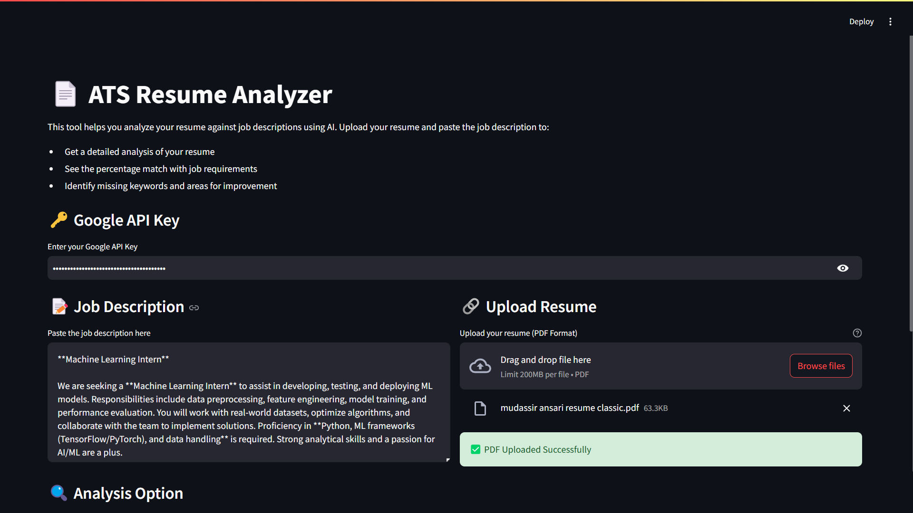

# ATS Resume Analyzer

## 📄 Overview
ATS Resume Analyzer is an AI-powered tool that helps job seekers evaluate their resumes against job descriptions. It provides a detailed analysis, match percentage, keyword insights, and suggestions for improvement, leveraging Google's Gemini API.

## 🚀 Features
- Upload a resume in **PDF format**
- Paste a **job description**
- Perform:
  - **Detailed Resume Review**: Get insights on strengths, gaps, and recommendations
  - **Match Percentage Analysis**: See match percentage, keyword alignment, and improvement tips
- **Downloadable analysis report**
- Simple and intuitive **Streamlit UI**

## 🛠️ Tech Stack
- **Python** (Backend logic)
- **Streamlit** (User Interface)
- **PyPDF2** (PDF text extraction)
- **Google Gemini AI** (AI-powered resume analysis)
- **dotenv** (Environment variable management)

## 📌 Installation
1. Clone this repository:
   ```bash
   git clone https://github.com/Mudassir-A/ats-senpai.git
   cd ats-resume-analyzer
   ```
2. Install dependencies:
   ```bash
   pip install -r requirements.txt
   ```
3. Set up your API key:
   - Create a `.env` file in the project root
   - Add your **Google API Key**:
     ```
     GOOGLE_API_KEY=your_api_key_here
     ```

## ▶️ Usage
Run the Streamlit app:
```bash
streamlit run app.py
```

### Steps to Analyze a Resume:
1. **Paste the job description**
2. **Upload your resume (PDF format)**
3. **Select the analysis type**
4. Click **Analyze Resume**
5. **View results & download the report**

## 📌 Screenshots



## 🔥 Future Enhancements
- Support for multiple resume formats (DOCX, TXT)
- Advanced AI-based resume optimization
- More ATS-focused insights

## 📜 License
This project is licensed under the MIT License.

---
**Made with ❤️ by Mohd Mudassir Ansari**
